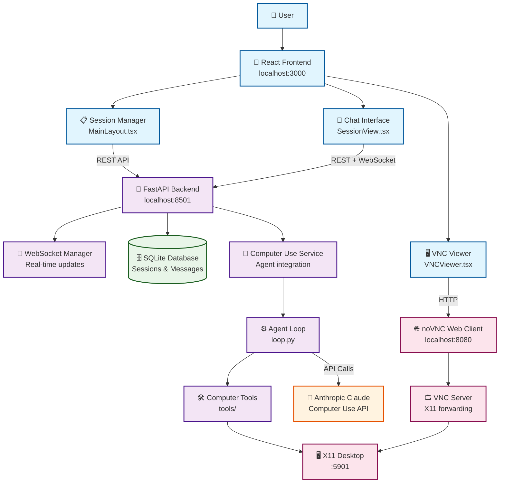

# Author
Asim Hameed Khan
**Email**: asimhameed.cs@gmail.com
**LinkedIn**: https://www.linkedin.com/in/asimniazi63/

# Energent AI (Challenge)

A rebuilt version of the Anthropic Computer Use Demo with FastAPI backend completely replacing Streamlit, featuring modern React frontend and comprehensive session management.

## Table of Contents

- [Quick Start](#quick-start)
  - [Development Workflow](#development-workflow)
  - [Production Workflow](#production-workflow)
- [Repository and Codebase Overview](#repository-and-codebase-overview)
  - [Architecture](#architecture)
  - [Directory Structure](#directory-structure)
  - [Technology Stack](#technology-stack)
- [Service Launch and Endpoint Functionality](#service-launch-and-endpoint-functionality)
  - [Available Endpoints](#available-endpoints)
  - [WebSocket Communication](#websocket-communication)
  - [VNC Integration](#vnc-integration)
- [Backend Details](#backend-details)
  - [FastAPI Application](#fastapi-application)
  - [Database Models](#database-models)
  - [Computer Use Service](#computer-use-service)
  - [Session Management](#session-management)
- [Frontend Details](#frontend-details)
  - [React Application](#react-application)
  - [Components](#components)
  - [State Management](#state-management)
  - [Real-time Communication](#real-time-communication)

---

## Quick Start

### Prerequisites
- Docker and Docker Compose
- Anthropic API key (can be added later for development)

### Quick Launch Scripts

The project includes two optimized launch scripts:

- **`./run-dev.sh`** - Complete development environment with hot reload
- **`./run-prod.sh`** - Production deployment with optimized builds

Both scripts handle:
- ✅ Docker installation verification
- ✅ Environment setup and validation  
- ✅ Container management (stop/restart)
- ✅ Comprehensive error checking
- ✅ Clear status messages and access URLs

### Development Workflow

**Blackbox Approach - Just Run It:**

1. **Start Development:**
   ```bash
   cd /home/asim/Desktop/challenge/energent
   ./run-dev.sh
   ```
   
   The development script will:
   - ✅ Check Docker installation
   - ✅ Create `.env` file from template if needed
   - ✅ Allow development without API key (with prompt)
   - ✅ Set up data directory
   - ✅ Start development containers with hot reload

2. **Access Services:**
   - 🎨 **Frontend**: http://localhost:3000 (React app with hot reload)
   - 🚀 **Backend API**: http://localhost:8501 (FastAPI with auto-reload)
   - 📚 **API Docs**: http://localhost:8501/docs (Interactive OpenAPI documentation)
   - 🖥️ **VNC Viewer**: http://localhost:8080 (Real-time desktop view)

**Development Features:**
- Hot reload for both frontend and backend
- Volume mounting for instant code changes
- Development-optimized Docker builds
- Detailed logging and debugging

### Production Workflow

**Blackbox Approach - Deploy It:**

1. **Deploy Production:**
   ```bash
   cd /home/asim/Desktop/challenge/energent
   ./run-prod.sh
   ```
   
   The production script will:
   - ✅ Check Docker installation  
   - ✅ Require `.env` file with valid API key
   - ✅ Strict validation for production requirements
   - ✅ Start containers in detached mode
   - ✅ Display management commands

2. **Access Services:**
   - 🎨 **Frontend**: http://localhost:3000 (Optimized build with Nginx)
   - 🚀 **Backend API**: http://localhost:8501 (Production FastAPI)
   - 📚 **API Docs**: http://localhost:8501/docs
   - 🖥️ **VNC Viewer**: http://localhost:8080

**Production Features:**
- Optimized React build with Nginx serving
- Production-ready FastAPI configuration
- Persistent data volumes
- Container restart policies
- Resource optimization

---

## Repository and Codebase Overview

### Architecture

This project implements a **modern microservices architecture** with clear separation of concerns:



**Key Architectural Decisions:**
- **FastAPI replaces Streamlit**: Modern REST API with WebSocket support
- **Session-based workflows**: Multiple concurrent agent tasks
- **Real-time communication**: WebSocket for live updates
- **Persistent storage**: SQLite for session and message history
- **VNC integration**: Live desktop viewing capabilities

### Directory Structure

```
energent/                              # Project root
├── backend/                           # 🎯 Main application container
│   ├── computer_use_demo/            # Python package
│   │   ├── api/                      # 🆕 FastAPI backend
│   │   │   ├── main.py              # FastAPI application & routes
│   │   │   ├── models.py            # Pydantic data models
│   │   │   ├── database.py          # SQLite database layer
│   │   │   ├── websocket_manager.py # WebSocket connections
│   │   │   └── computer_use_service.py # Agent integration
│   │   ├── loop.py                  # ✅ Original agent loop
│   │   ├── tools/                   # ✅ Computer use tools
│   │   └── requirements.txt         # Python dependencies
│   ├── start_fastapi.py             # Standalone startup script
│   ├── Dockerfile                   # Production container
│   └── image/                       # VNC setup & configuration
├── frontend/                         # 🎨 React application
│   ├── src/
│   │   ├── components/              # React components
│   │   │   ├── MainLayout.tsx       # Session management UI
│   │   │   ├── SessionView.tsx      # Chat interface
│   │   │   ├── ChatMessage.tsx      # Message components
│   │   │   ├── VNCViewer.tsx        # Desktop viewer
│   │   │   └── FileManager.tsx      # File browser
│   │   ├── services/                # API clients
│   │   │   ├── api.ts               # REST API client
│   │   │   └── websocket.ts         # WebSocket client
│   │   └── types/                   # TypeScript definitions
│   ├── Dockerfile                   # Production build
│   ├── Dockerfile.dev               # Development build
│   └── package.json                 # Node.js dependencies
├── scripts/                          # 🛠️ Utilities (diagram generation)
│   └── generate-diagram.py          # Architecture diagram generator
├── docker-compose.yml                # Production deployment
├── docker-compose.dev.yml            # Development setup
├── run-dev.sh                        # 🚀 Development launcher
├── run-prod.sh                       # 🏭 Production launcher
└── README.md                         # This file
```

### Technology Stack

**Backend:**
- **FastAPI**: Modern Python web framework with automatic OpenAPI docs
- **SQLite + aiosqlite**: Lightweight database with async support
- **WebSockets**: Real-time bidirectional communication
- **Anthropic API**: Claude computer use capabilities
- **VNC/X11**: Desktop environment for agent interaction

**Frontend:**
- **React 18**: Modern UI library with hooks
- **TypeScript**: Type-safe JavaScript development
- **Material-UI**: Google's Material Design components
- **Axios**: HTTP client for API communication
- **React Router**: Client-side routing

**Infrastructure:**
- **Docker**: Containerized deployment
- **Nginx**: Production web server for frontend
- **Docker Compose**: Multi-container orchestration

---

## Service Launch and Endpoint Functionality

### Available Endpoints

**Health & Status:**
- `GET /` - Basic health check
- `GET /health` - Detailed service status

**Session Management:**
- `GET /api/sessions` - List all sessions with metadata
- `POST /api/sessions` - Create new agent session
- `GET /api/sessions/{id}` - Get specific session details
- `DELETE /api/sessions/{id}` - Delete session and history
- `POST /api/sessions/{id}/start` - Start/resume session
- `POST /api/sessions/{id}/stop` - Stop active session

**Message Management:**
- `GET /api/sessions/{id}/messages` - Get session chat history
- `POST /api/sessions/{id}/messages` - Send message to agent

**Real-time Communication:**
- `WS /ws/{session_id}` - WebSocket for live updates

**VNC Integration:**
- `GET /api/vnc/{session_id}` - Get VNC connection information

### WebSocket Communication

The WebSocket endpoint provides real-time updates for:

**Message Types:**
- `message` - New chat messages from user/agent
- `session_status` - Session state changes (active/stopped/error)
- `tool_execution` - Live tool usage and results
- `thinking` - Agent reasoning process (when enabled)

**Client Communication:**
```javascript
// Connect to session
ws = new WebSocket(`ws://localhost:8501/ws/${sessionId}`);

// Send ping to keep alive
ws.send(JSON.stringify({ type: 'ping' }));

// Subscribe to updates
ws.send(JSON.stringify({ type: 'subscribe' }));
```

### VNC Integration

**Desktop Access:**
- Full X11 desktop environment running in container
- noVNC web client for browser-based access
- Real-time viewing of agent actions
- Integrated iframe within React interface

**Endpoints:**
- `http://localhost:8080` - noVNC web interface
- `vnc://localhost:5901` - Direct VNC connection
- Display `:1` with 1024x768 resolution

---

## Backend Details

### FastAPI Application

**Core Features:**
- **Async/await**: Non-blocking request handling
- **Automatic OpenAPI**: Interactive documentation at `/docs`
- **Pydantic validation**: Type-safe request/response models
- **CORS support**: Cross-origin requests for frontend
- **WebSocket support**: Real-time communication
- **Dependency injection**: Clean database connection management

**Key Files:**
- `api/main.py` - Main application, routes, and WebSocket handling
- `api/models.py` - Pydantic models for data validation
- `api/database.py` - SQLite database operations
- `api/websocket_manager.py` - WebSocket connection management
- `api/computer_use_service.py` - Agent integration layer

### Database Models

**Session Model:**
```python
class SessionResponse(BaseModel):
    id: str                    # UUID identifier
    name: str                  # User-defined name
    description: Optional[str] # Optional description
    status: SessionStatus      # created/active/stopped/error
    created_at: datetime       # Creation timestamp
    updated_at: datetime       # Last modified timestamp
    message_count: int         # Number of messages
```

**Message Model:**
```python
class MessageResponse(BaseModel):
    id: str                    # UUID identifier
    session_id: str           # Parent session
    content: str              # Message text/data
    message_type: MessageType # user/assistant/tool/system/thinking
    sender: str               # Message origin
    metadata: Optional[Dict]  # Additional data (images, etc.)
    created_at: datetime      # Creation timestamp
```

### Computer Use Service

**Integration Layer:**
- Bridges FastAPI with original Anthropic agent code
- Handles message processing and tool execution
- Manages agent state and conversation context
- Streams results back via WebSocket

**Key Capabilities:**
- **Tool execution**: Screen capture, clicking, typing, file operations
- **Multi-modal**: Text and image processing
- **State management**: Persistent conversation context
- **Error handling**: Graceful failure recovery

### Session Management

**Lifecycle:**
1. **Created** - Session initialized, ready for messages
2. **Active** - Agent processing messages and executing tools
3. **Stopped** - Session paused, can be resumed
4. **Error** - Session encountered fatal error

**Features:**
- Multiple concurrent sessions
- Persistent message history
- Session isolation and state management
- Background task processing

---

## Frontend Details

### React Application

**Architecture:**
- **TypeScript**: Type-safe development with interfaces
- **Material-UI**: Consistent, accessible component library
- **React Router**: Client-side routing for SPA experience
- **Axios**: Promise-based HTTP client with interceptors

**Key Features:**
- **Responsive design**: Works on desktop and tablet
- **Real-time updates**: WebSocket integration for live chat
- **Session management**: Create, view, and manage multiple tasks
- **VNC integration**: Embedded desktop viewer
- **File management**: Basic file browser interface

### Components

**MainLayout.tsx** - Session Management Dashboard:
- Session list with status indicators
- Create new session dialog
- Start/stop/delete session controls
- Real-time status updates

**SessionView.tsx** - Chat Interface:
- ChatGPT-style conversation interface
- Message history with timestamps
- Real-time message streaming
- Tool execution results with images
- VNC viewer integration
- File manager sidebar

**ChatMessage.tsx** - Message Display:
- Support for different message types (user/assistant/tool/thinking)
- Markdown rendering for formatted text
- Image display for screenshots
- Expandable sections for detailed output
- Timestamp and sender information

**VNCViewer.tsx** - Desktop Integration:
- Embedded noVNC client
- Responsive iframe sizing
- Connection status monitoring
- Full-screen toggle option

### State Management

**Local State with Hooks:**
- `useState` for component state
- `useEffect` for lifecycle management
- `useNavigate` for programmatic routing
- Custom hooks for WebSocket management

**Data Flow:**
1. **API calls** via Axios for HTTP requests
2. **WebSocket** for real-time updates
3. **Local state** updates trigger UI re-renders
4. **Optimistic updates** for better UX

### Real-time Communication

**WebSocket Integration:**
```typescript
// Connection management
const connectWebSocket = (sessionId: string) => {
  const ws = new WebSocket(`ws://localhost:8501/ws/${sessionId}`);
  
  ws.onmessage = (event) => {
    const data = JSON.parse(event.data);
    handleWebSocketMessage(data);
  };
};

// Message handling
const handleWebSocketMessage = (data: any) => {
  switch (data.type) {
    case 'message':
      setMessages(prev => [...prev, data.data]);
      break;
    case 'session_status':
      setSessionStatus(data.data.status);
      break;
  }
};
```

**Features:**
- Automatic reconnection on connection loss
- Message queuing during disconnection
- Typing indicators and presence
- Live tool execution updates

---

## Diagram Generation

The README contains a detailed Mermaid diagram showing the system architecture. You can generate image versions of this diagram using the provided Python script:

### Quick Generation

```bash
cd /home/asim/Desktop/challenge/energent
python scripts/generate-diagram.py
```

### Output Files

The script will create a `docs/diagrams/` directory with:
- `energent-architecture.mmd` - Raw Mermaid source
- `energent-architecture.png` - PNG image (if CLI available)
- `energent-architecture.svg` - SVG vector image (if CLI available)
- `energent-architecture.pdf` - PDF version (if CLI available)
- `energent-architecture.html` - Interactive HTML preview

### Installation Requirements

**For full functionality:**
```bash
# Install Mermaid CLI (for best results)
npm install -g @mermaid-js/mermaid-cli

# The script also works without CLI, generating:
# - HTML preview (works in any browser)
# - Raw .mmd file for manual processing
```

**Alternative methods:**
- Use the generated HTML file (no installation needed)
- Copy content to [Mermaid Live Editor](https://mermaid.live/)

---